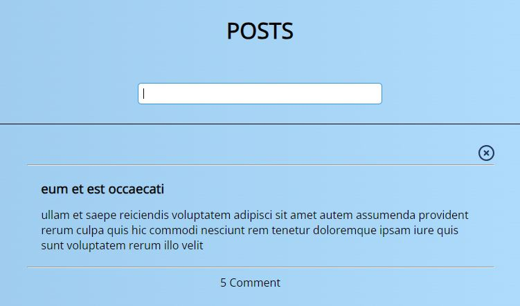
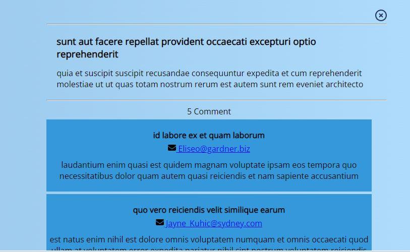
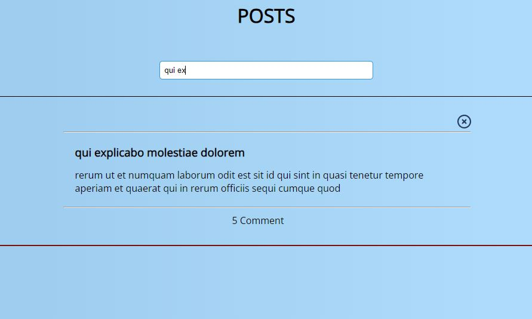
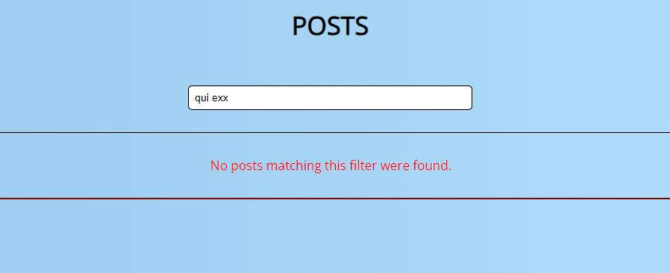

<h1>Post App</h1>

The purpose of this project is to show the post data coming from the backend API to the user and to enable the user to see the messages written for each post. If the user wishes, can filter posts by entering a value in the input field 

<h2>Technologies used in the project</h2>
<ul>
  <li>✔️ HTML</li>
  <li>✔️ CSS</li>
  <li>✔️ JavaScript</li>
</ul>

<h2>Images</h2>  

    

      

      

      

